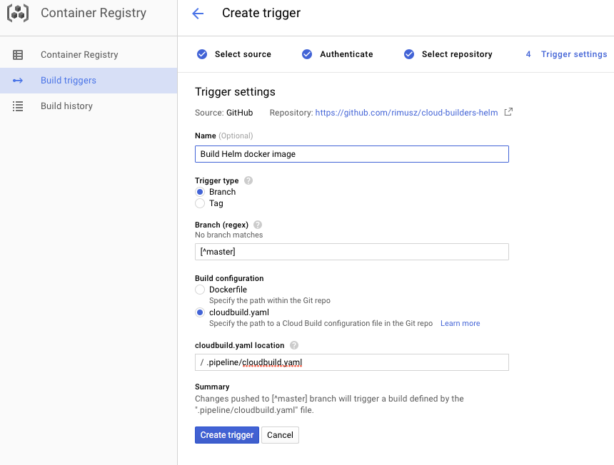

# GCP Container Builder with Helm client


This Container Builder build step runs [`helm`](https://github.com/kubernetes/helm).
Is available as `gcr.io/rimusz-lab1/cloud-builders-helm`

## Using this builder with Google Container Engine

To use this builder, your
[builder service account](https://cloud.google.com/container-builder/docs/how-to/service-account-permissions)
will need IAM permissions sufficient for the operations you want to perform. For
typical read-only usage, the "Container Engine Viewer" role is sufficient. To
deploy container images on a GKE cluster, the "Container Engine Developer" role
is sufficient. Check the
[GKE IAM page](https://cloud.google.com/container-engine/docs/iam-integration)
for details.

For most use, `helm` will need to be configured to point to a specific GKE
cluster. That can be done using `kubectl` step (check [examples](examples))
where you need to configure the cluster by setting environment variables.

    CLOUDSDK_COMPUTE_ZONE=<your cluster's zone>
    CLOUDSDK_CONTAINER_CLUSTER=<your cluster's name>

Setting the environment variables above will cause this step's entrypoint to
first run a command to fetch cluster credentials as follows.

    gcloud container clusters get-credentials --zone "$CLOUDSDK_COMPUTE_ZONE" "$CLOUDSDK_CONTAINER_CLUSTER"`

The `kubeconfig` will be saved to `/workspace/.kube/config`, then, `helm` will
have the configuration needed to talk to your GKE cluster.

Example of `cloudbuild.yaml` file:
```
steps:

# fetch GKE cluster credentials to be used for helm step
- name: 'gcr.io/cloud-builders/kubectl'
  env:
  - 'CLOUDSDK_COMPUTE_ZONE=<your cluster's zone>'
  - 'CLOUDSDK_CONTAINER_CLUSTER=<your cluster's name>'
  - 'KUBECONFIG=/workspace/.kube/config'
  args: ['cluster-info']

# run helm command to install/upgrade etcd-operator
# optionally you can set to add any other Helm chart repository
# to use charts from
- name: 'gcr.io/$PROJECT_ID/cloud-builders-helm'
  env:
  - 'KUBECONFIG=/workspace/.kube/config'
  - 'HELM_REPO_NAME=example'
  - 'HELM_REPO_URL=http://charts.example.com'
  args: [ "helm", upgrade", "--install", "etcd-operator", "--namespace=etcd", "stable/etcd-operator", "--set", "image.tag=v0.3.2" ]

```

## Building this builder

To build this builder, run the following commands in this directory.

    $ ./.scripts/set_tag.sh
    $ gcloud container builds submit . --config=.pipeline/cloudbuild.yaml

The first step sets Helm client version (stored in TAG file) to be used for building the image,
and the second builds the docker image and stores it under your GCP `project/helm` repo.

You can also automate builds by using `Container Registry build trigger` and connecting it your your `Github` repo
as per example below:


